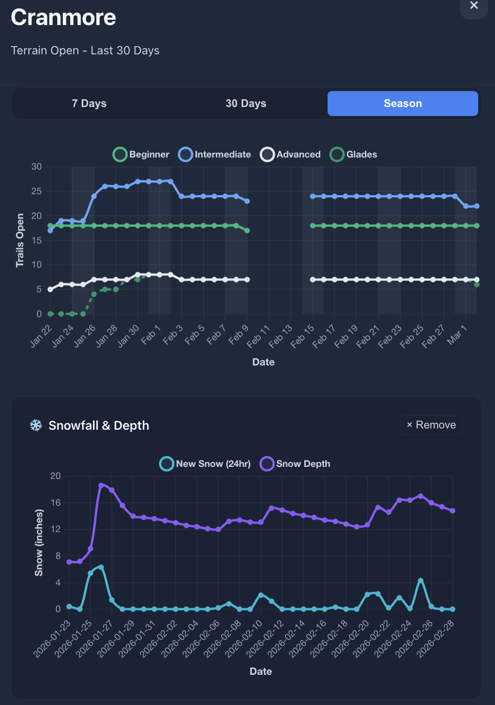

# Powder Predictor

**Real-time ski conditions dashboard with production monitoring and AI-powered snow report summaries**

Aggregates snow reports and weather from three NH mountains into a unified dashboard with automated health monitoring and intelligent text summarization.

---

#### I was tired of visitng multiple websites for snow reports and weather data. Plus, ski resorts typically only show *today's* conditions. Powder Predictor:

- **Aggregates data** - One dashboard, all mountains
- **Shows history** - Resorts hide their seasonal decline; this shows it
- **Summarizes relevant information** - Resort reports bury conditions in marketing text
- **Monitors itself** - Scrapers text you when they fail

## Mountains Tracked
- Cranmore Mountain Resort
- Bretton Woods Mountain Resort  
- Cannon Mountain

---

## Architecture


### Data Pipeline
- **Bronze**
    - Raw HTML/JSON from scrapers |
- **Silver**
    - Parsed terrain counts, weather, AI summaries, closure detection
- **Gold**
    - Analytics-ready Parquet + metrics

### Stack

| Layer | Technology |
|-------|-----------:|
| **Language** | Python 3.11
| **Orchestration** | Apache Airflow
| **Storage** | MinIO (S3-compatible)
| **Data Warehouse** | DuckDB
| **Format** | Delta Lake (Parquet)
| **Container** | Docker + Docker Compose
| **NLP** | HuggingFace DistilBART, launchd |
| **API** | FastAPI, boto3 |
| **Frontend** | Vanilla JS, Chart.js |
| **Monitoring** | Healthchecks.io |



*Dark-theme dashboard displaying historical trail counts by difficulty (Beginner/Intermediate/Advanced/Glades) and weather metrics (new snow, snow depth) with interactive time range selector.*

---

## Technical Wins

### 1. Production Health Monitoring
Scrapers run in Airflow (Docker) and ping **Healthchecks.io** on success. If a scraper doesn't ping, you get texted within minutes.

**Why this matters**: Data pipelines fail silently. This catches it immediately.

```python
# In scraper DAG
import requests

try:
    # Scrape mountains
    scrape_all_mountains()
    # Success - ping healthcheck
    requests.get(f"https://hc-ping.com/{HEALTHCHECK_UUID}")
except Exception as e:
    logger.error(f"Scrape failed: {e}")
    # Failure triggers alert (no ping = timeout)
```

Result: **3 scrapers × 2 daily runs = 6 alerts/day if working**. Caught issues in hours vs. days.

### 2. NLP Snow Report Summarization
Snow reports are 700+ words of marketing with important condition information sprinkled in. **DistilBART** extracts the 80-word essence and ignores optimistic bias.

**Original (excerpt):**
> "We had fantastic corduroy on the intermediate trails today... we've had several events this past weekend so traffic was somewhat heavy... don't forget our season pass deals are still..."

**Summarized:**
> "Excellent corduroy on intermediate terrain. Recent events drew crowds. Check conditions on upper mountain before heading up."

Runs locally via **launchd** (macOS scheduler) after daily transforms—no containerization overhead for ML.

### 3. Clean Data Architecture (Bronze → Silver → Gold)
- **Bronze**: Raw scraped data (historical record)
- **Silver**: Cleaned, validated, standardized for analytics
- **Gold**: Derived features and model outputs

Separated concerns = easy to version, debug, and improve transformations independently.

### First Successful MVP Built with Claude Code
1. Great conversations on the benefits and drawbacks of architectural choices
2. Tested variations in context recall and abstract decision-making between Claude models
3. "cruise control test": when I run out of tokens, does it feel like I can't use cruise control or does it feel like I can't drive? It was interesting to see what parts of this project fell into what category, and how motivated I was to understand various aspects more, or not.
    - Data Pipeline Work: I love driving
    - API: I can do this, I can do this
    - CSS: Help

---

## Getting Started

```bash
# Setup
git clone <repo>
cd powder-predictor
python -m venv venv && source venv/bin/activate
pip install -r requirements.txt

# Configure
cp .env.example .env  # Add MinIO credentials, Healthchecks UUID

# Run
docker-compose up -d              # Airflow + MinIO
uvicorn api.main:app --port 8001  # API
# Open http://localhost:8000
```

---

## Project Structure

```
powder-predictor/
├── dags/               # Airflow scrapers + transforms
├── src/               # Reusable modules
├── scripts/           # Summarization automation
├── notebooks/         # Analysis + backfills
├── api/               # FastAPI endpoints
├── frontend/          # Dashboard
└── data/gold/         # Parquet files
```

---

## Future Work

- ML-based powder prediction
- Alerts for powder days
- Climate trend analysis


---

## Project Status
🚧 In Development

## License
Personal project - not for commercial use